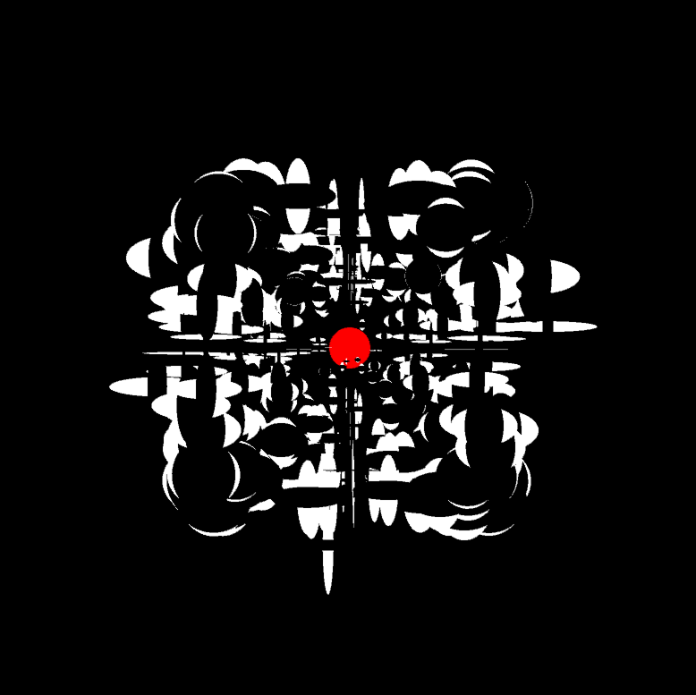
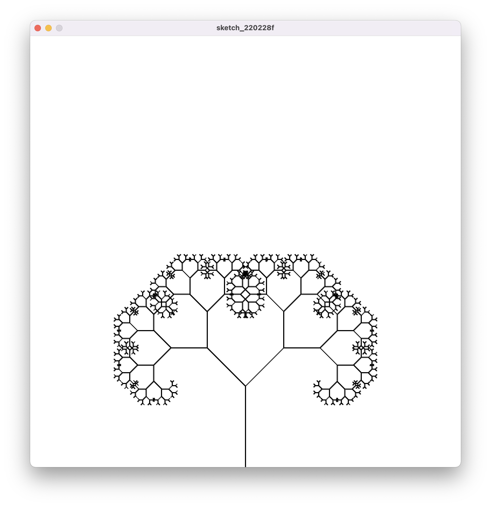
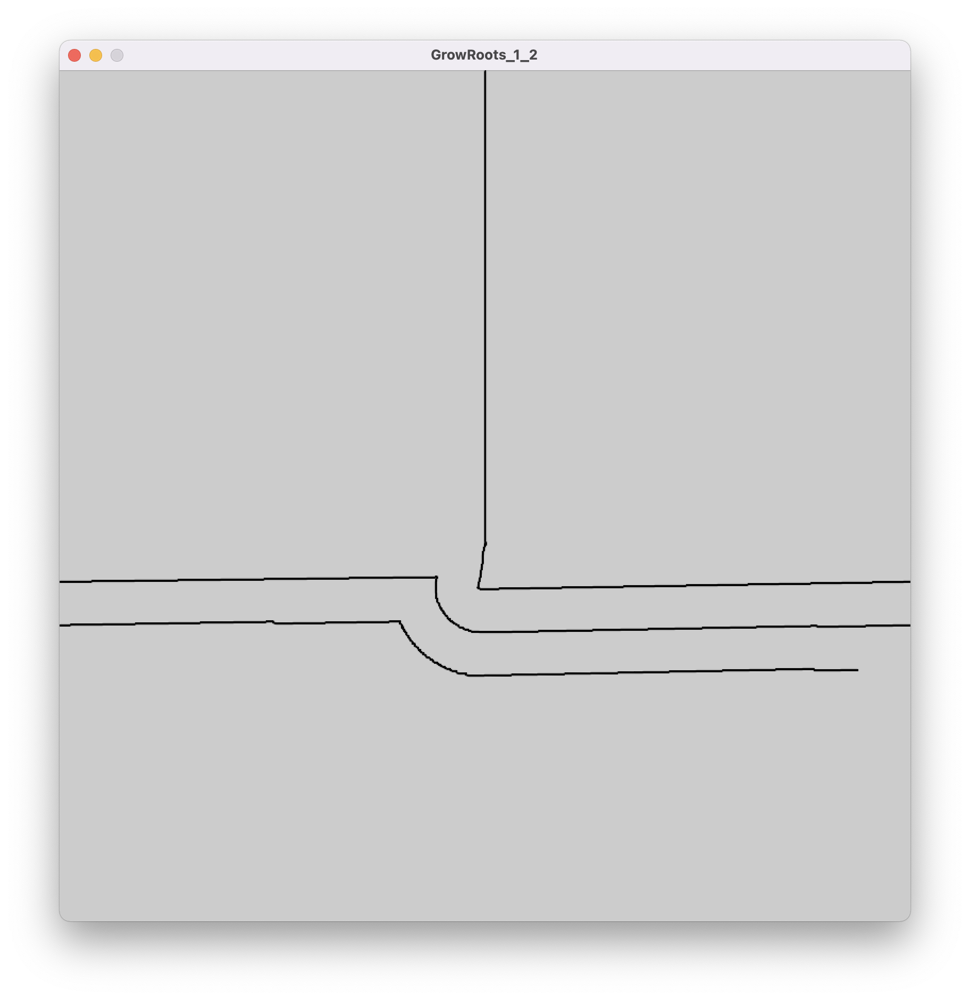

# Shortcut - Processing Documentation

### 2022-02-25: First Steps
I have no real idea about how to create generative visual designs - apart from what we briefly touched on in the Emergence class of CC1. 
I realise that I need a stronger foundational basis on coding design techniques and have started with chapter one of Shiffman's Nature of Code in the hope that it can give me a basis quickly as I'm getting a bit worried about the deadline.

### 2022-02-27: First Design
Got through the first chapter of Nature of Code, which culminated with accelerating a sphere towards the mouse position using vector math to simulate inertia and acceleration.   
I went further with the idea and created another ellipse object following a random path, which many other ellipses are drawn to. The idea is to create a swarm effect and perhaps gain inspiration for drawing out emergent behaviour. 


   
[Mover Sketch 1.0 Code folder](../PROCESSING/Mover_1/)   

 
   
[Mover Sketch 1.1 code folder](../PROCESSING/Mover_1_1/)  

 
   
[Mover sketch 1.2 code folder](../PROCESSING/Mover_1_2/)  

### 2022-02-28
Worked on the mover sketch but modified to P3D to make drawing depth easier. 
Came to this idea which could fit the floor canvas well as it may create a sense of standing on a transparent ceiling and looking down into infinite depth. 


   
[FloatCeiling 1.0](../PROCESSING/FloatCeiling_1_0/FloatCeiling_1_0.pde)


### 2022-03-01: Fractal / Recursive
Considered how to approach a sketch design for the floating sphere in the VR world. The canvas gets wrapped horizontally, making a vertical edge on one side of the sphere. In order to get around this edge being visible I should make sure that whatever I sketch, should draw continuously front one edge, to its opposing edge (ie teleportation). 

I've found the examples of fractal design and recursive functions and think they could suit well for the sphere. 


Considered the idea of following some "natural" random behaviour and growing a root system over the sphere until it becomes fully entangled. I would like to make it so that the roots will never cross paths with one another to try out some emergence pattern variations. 


   
[Grow roots 1.0 code folder](../PROCESSING/GrowRoots_1_0/)   

Proving to be incredibly complicated to create a collision detection with drawn paths... 
I need to keep track of the previous xy positions of each root. I can now get those values into an ArrayList in real time as the root is moving. 
```java
PVector storeDrawn() {
  PVector v = new PVector(0, 0);
  drawn.add( new PVector(root[0].location.x, root[0].location.y));
  for (int i = 0; i < drawn.size(); i++){
  v = drawn.get(i);
  }

return v;
}
```
Now need to figure out how to create collision detection against those values in the array.    
Something like: check current xy position against all previous individual xy values stored in the array(?).

### 2022-03-02: Accidental Step Backwards
So after an entire day of figuring out dealing with dynamically adding and getting from PVector arrays within a class, and checking positions against actual current positions, I accidentally remade a random walker albeit with 5x as much code...


What was making it simply become a random walker was that I was checking the current position against the previous position *immiediately*. This meant that it was trying to take a different path at every frame as its current position was always its last position.    
As well as that, the choice of random path involved a range of numbers that gave too wild of result (haven't entirely figured out why). See line 72 in [Root.pde](../PROCESSING/GrowRoots_1_1/Root.pde).

I changed the above functions and values to this, and it's behaving more toward what I want:    
```java 

  // check if current xy pos will collide with any previous xy pos. 
  void collisionDetect() {
    
      for (int i = 100; i < drawn.size(); i++) {
        if (dist(location.x, location.y, drawn.get(i-90).x, drawn.get(i-90).y) < 40) {
          direction.add(20, 0); // If the distance between current xy and all previous xy positions starting 90 iterations before, do this.
          alterPath();
          println("collision detected");
        }
      }
  }

  // random path variation
  void alterPath() {
    velocity.add(random(-1.0, 0), random(1, 0));
  }
  ```

     
  
  Some emergent behaviour already showing. Above the target (xy coordinates that the root wants to move to) is set to (width / 2, height / 2), by changing the target to (width / 2, height):      
  

### 2022-03-03: Getting Roots
In the interest of time I've given up for the moment on getting the root tip to avoid crossing its previous drawn path (stem). For a while it seemed that I was getting good results. The root would noticibly grow against the edges of its previous path, if it came close to it, but then at some point it would cross itself. Even while crossing itself, it would still be triggering the collision detection statement that had until then observably been working.    
I tried asking in the processing forum, and was told that it could be a glitch where the ellipse is actually moving between the previously drawn ellipses (which consititute its previous path / stem). But I don't think this is the case, as the if statement includes an offset of the ellipses own radius, so it shouldn't have any space at all to get in between the cracks of the previous path...

I've kept the collision check and am now using it to spawn extra objects when true. The result is still looking good and some emergent behaviour is starting to arise:    
   
[Grow Roots 1.3 Code Folder](../PROCESSING/GrowRoots_1_3/)   

   
Also able to get some very different and interesting results by changing only a few values now. The above gif is playing with the direction of the newly spawned roots and colour fade functioning with gaussian noise.    

### 2022-03-04
After more experimentation this morning, I've arrived at a pretty interesting mix between "root like behaviour" and terrain generation. The amount of random variation I have is yielding something slightly different each time. So it's a bit confined, which is good for the moment.    
I think this is acceptable for the sphere. I will put another half day of work into experimenting with some more variation, but will then need to move on to the final sketch and then to finishing the vr side. State of the art at this point:
    
[Grow Roots 1.4 Code Folder](../PROCESSING/GrowRoots_1_4/)    

Experimentation proved fruitful. 
I finally figured out that to get the more varied / wild random movement of each individual root, I had to vary the acceleration PVector with by multiplying it with a random variable. As well as this, added some modulation to alpha and size. Ended up achieving close to what I wanted (if you look closely, the roots do avoid one another for the most part). Happy to move on now!    

[Grow Roots 1.6 Code Folder](../PROCESSING/GrowRoots_1_6/)


### 2022-03-05
For the final sketch I thought of returning to the recursion idea, as I really want to experiment with hypnotic visuals and patterns. At some point I would like to recreate a callidoscopic hallucination I had once when I was around eight years old, that I can still vividly remember.     
To present this sketch interestingly in VR, I thought of creating a floating concave hemisphere, with a "U" section cut out of the bottom. The user would walk into the hollow space of this "U" and be fully surrounded by the inside surface of the hemisphere, enabling an effective viewing environment to play with depth and perception as the user's full field of view will be used. 

Pretty easy to achieve in the end. Despite how much of a cheap trick this is, with a bit more fine tuning and good design intent it will suit the concave viewing space well. And it will also buy me some needed time to devote time to the VR implementation and to polish everything up including documentation.
   
[Recursive 1.0 Code](../PROCESSING/Recursive_1_0/Recursive_1_0.pde)

### 2022-03-06
It's gotten pretty psychedelic now... I've tried to fine tune it so that the callidoscopic effect doesn't become too predictable. Modulating the alpha and colour values independant of the rotational / scaling movement was essential, as it created some asynchronos phasing in the design elements. What I do like about this though is the colour scheme the stroke trails make. Despite this being a bit of a cheap trick, it was a good moment for me to explore recursion and pattern generation. Also because it fits theamatically with idea behind the VR environment being a dream. The music I will include in the hemispherical viewing space will also be designed to suit this experience.

[Recursive 1.4 Code](../PROCESSING/Recursive_1_4/Recursive_1_4.pde)


### Running Notes
Recurssion looks cool: https://processing.org/examples/recursion.html