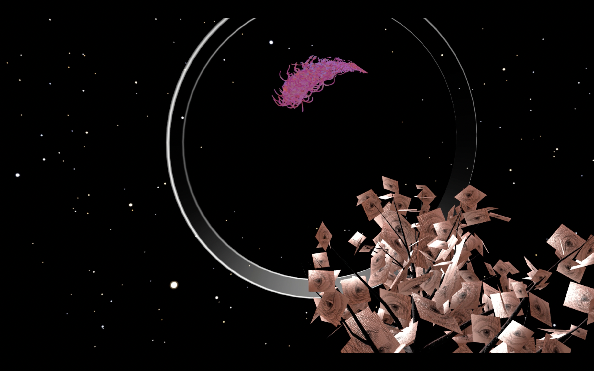

# "Shortcut" - First Term Masters Project

## Introduction
Virtual reality provides an opportunity to experience digital artworks in new ways. But the VR environment in this sense should not mimic the paradigms of art consumption we know and trust by rebuilding art galleries and viewing cinemas as we know them. We should be more imaginative. "Shortcut" is an exploration of this new opportunity. It offers a space between reality and dreamscape, where curiosity and surrealism are integrated into the act of viewing graphical artworks and listening to music. 

[Here you can watch a demonstration of the project on Youtube.](https://youtu.be/iWeQOEhx4YA)

## Navigation
This repository includes:
- [Documentation of Processing](https://github.com/tillmanjex/Shortcut-FirstTermProject/blob/main/DOCUMENTATION/Shortcut%20-%20Processing%20Documentation.md) sketch designs
- [Documentation of Unity](https://github.com/tillmanjex/Shortcut-FirstTermProject/blob/main/DOCUMENTATION/Shortcut%20-%20VR%20Documentation.md) development
- [Development log](https://github.com/tillmanjex/Shortcut-FirstTermProject/blob/main/DOCUMENTATION/Shortcut%20-%20Dev%20Log.md) development

  
